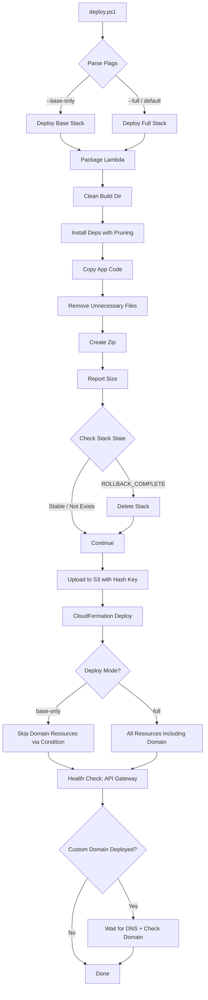
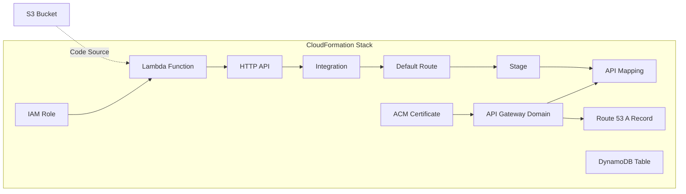

# Design Document: Custom Domain Deployment

## Overview

This design addresses the reliable deployment of the Orientation Mali application to the custom domain `orientation-mali.com`. The solution enhances the existing `deploy.ps1` script and `template-cf.yaml` CloudFormation template to handle:

1. **ACM certificate DNS validation** — CloudFormation's built-in DNS validation via Route 53 integration, with appropriate timeout handling
2. **Lambda package size optimization** — Aggressive pruning of unnecessary files to stay well within the 250 MB unzipped limit
3. **Two-phase deployment** — Optional separation of base infrastructure from custom domain resources to avoid certificate timeout blocking core deployment
4. **Deployment recovery** — Detection of failed stack states and automated recovery
5. **Post-deployment validation** — Health checks against both the API Gateway endpoint and custom domain

The design leverages CloudFormation's native ACM-Route 53 integration (DomainValidationOptions with HostedZoneId) which automatically creates DNS validation records. The key insight is that the existing template already has this configured correctly — the primary issues are timeout handling, package size, and deployment robustness.

## Architecture





## Components and Interfaces

### 1. Deployment Script (`deploy.ps1`)

The PowerShell script is the primary interface. It orchestrates the entire deployment pipeline.

**Parameters:**
- `-Mode` — Deployment mode: `"full"` (default) or `"base"` (skip custom domain resources)
- No other parameters; all configuration is hardcoded (stack name, region, domain, hosted zone ID)

**Phases:**
1. **Clean** — Remove previous `.build` directory
2. **Package** — Install dependencies, copy code, prune, zip
3. **Stack State Check** — Detect failed stacks and handle recovery
4. **Upload** — Push zip to S3 with content-hash key
5. **Deploy** — Run `aws cloudformation deploy` with appropriate parameters
6. **Validate** — Health check endpoints

### 2. CloudFormation Template (`template-cf.yaml`)

**New additions:**
- `DeployCustomDomain` condition based on a `EnableCustomDomain` parameter (default: `"true"`)
- Conditional application to: `Certificate`, `ApiDomainName`, `ApiMapping`, `DnsRecord`
- Timeout-safe ACM configuration (already present, just needs the condition wrapper)

**Parameters (additions):**
- `EnableCustomDomain` — `"true"` or `"false"`, controls whether custom domain resources are created

### 3. Package Optimization Module (within `deploy.ps1`)

**Pruning targets:**
- `__pycache__/` directories
- `*.dist-info/` directories
- `tests/` directories within packages
- `*.pyc`, `*.pyo` files
- Documentation files (`README*`, `CHANGELOG*`, `LICENSE*` in dependency dirs)
- Unused binary files (`.so` files for unused platforms)
- `boto3` and `botocore` (provided by Lambda runtime)

### 4. Stack State Manager (within `deploy.ps1`)

**Logic:**
- Query stack status via `aws cloudformation describe-stacks`
- If `ROLLBACK_COMPLETE` or `DELETE_FAILED`: prompt to delete, then recreate
- If `UPDATE_ROLLBACK_COMPLETE`: proceed with update (stack is stable)
- If stack doesn't exist: proceed with create
- If `CREATE_COMPLETE` or `UPDATE_COMPLETE`: proceed with update

### 5. Health Check Module (within `deploy.ps1`)

**Checks:**
- HTTP GET to API Gateway endpoint URL (from stack outputs)
- HTTP GET to `https://orientation-mali.com/` (only in full mode, after DNS wait)
- Reports status code and truncated response body on failure

## Data Models

### CloudFormation Parameters

| Parameter | Type | Default | Description |
|-----------|------|---------|-------------|
| `S3Bucket` | String | — | Deployment bucket name |
| `S3Key` | String | — | Lambda package S3 key |
| `DomainName` | String | `orientation-mali.com` | Custom domain |
| `HostedZoneId` | String | — | Route 53 hosted zone ID |
| `EnableCustomDomain` | String | `true` | Toggle custom domain resources |

### S3 Key Format

```
lambda-package-{sha256-first-8-chars}.zip
```

The hash is computed from the zip file content, ensuring each unique package gets a unique key. This prevents Lambda from serving stale code due to S3 caching.

### Deployment Script Exit Codes

| Code | Meaning |
|------|---------|
| 0 | Success |
| 1 | Packaging failure |
| 2 | Stack state unrecoverable |
| 3 | CloudFormation deployment failure |
| 4 | Health check failure (warning, not blocking) |

## Error Handling

### ACM Certificate Validation Timeout

- CloudFormation's default timeout for resource creation is 60 minutes, which is sufficient for ACM DNS validation (typically 5-30 minutes)
- The template uses `DomainValidationOptions` with `HostedZoneId`, which triggers automatic DNS record creation by CloudFormation — no manual intervention needed
- If validation fails, CloudFormation rolls back automatically. The script detects this via non-zero exit code and reports the failure

### Stack in Failed State

- `ROLLBACK_COMPLETE`: Stack must be deleted before re-creation. Script detects this and offers deletion
- `UPDATE_ROLLBACK_COMPLETE`: Stack is stable and can accept updates. Script proceeds normally
- `DELETE_IN_PROGRESS` / `CREATE_IN_PROGRESS`: Script waits or exits with a message to retry later

### Package Size Exceeded

- Script reports both compressed and estimated unzipped size
- If unzipped estimate exceeds 200 MB (safety margin below 250 MB limit), script warns but continues
- Primary mitigation: exclude `boto3`/`botocore` (saves ~80 MB) since Lambda runtime provides them

### Network/DNS Failures During Health Check

- Health checks use a 30-second timeout per request
- Custom domain check waits up to 60 seconds for DNS propagation (polling every 10 seconds)
- Health check failures produce warnings but do not fail the deployment (exit code 4 is non-blocking in CI)

### S3 Upload Failures

- Script checks `$LASTEXITCODE` after `aws s3 cp`
- On failure, reports the error and exits before attempting CloudFormation deploy

## Testing Strategy

### Why Property-Based Testing Does Not Apply

This feature consists entirely of:
1. **Infrastructure as Code** — CloudFormation template (declarative YAML configuration)
2. **Deployment scripting** — PowerShell script making AWS CLI calls
3. **External service interactions** — S3 uploads, CloudFormation deployments, HTTP health checks

There are no pure functions, data transformations, parsers, or business logic that would benefit from property-based testing. The inputs don't form a meaningful space to generate random values over — the deployment either works with the specific AWS account/region/domain or it doesn't.

### Recommended Testing Approach

**1. Template Validation (Smoke Tests)**
- `aws cloudformation validate-template --template-body file://template-cf.yaml`
- Verify template syntax and parameter declarations are valid
- Run before every deployment

**2. Integration Tests (Manual/CI)**
- Deploy to a test stack and verify all resources are created
- Verify the Lambda function responds to HTTP requests
- Verify DNS resolution of the custom domain
- Verify HTTPS certificate is valid and trusted

**3. Script Logic Tests (Example-Based)**
- Test the S3 key hash generation produces consistent results for the same input
- Test stack state detection logic with mocked `aws` CLI responses
- Test package size reporting accuracy

**4. Deployment Dry Run**
- `aws cloudformation deploy --no-execute-changeset` to preview changes without applying them
- Useful for CI pipelines to validate before applying

**5. Rollback Testing**
- Intentionally deploy a broken template to verify rollback behavior
- Verify the script correctly detects `ROLLBACK_COMPLETE` state on next run
- Verify stack deletion and recreation works

