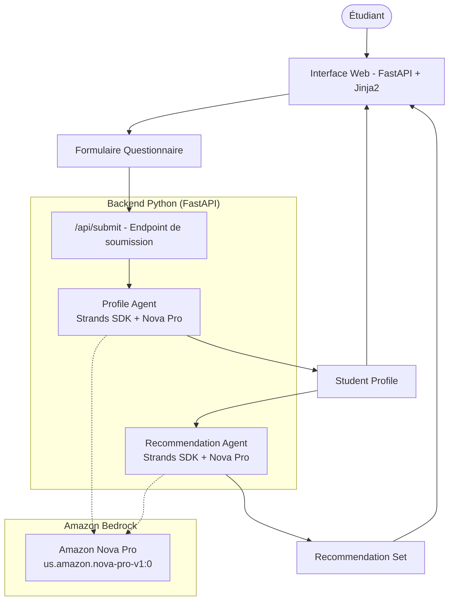
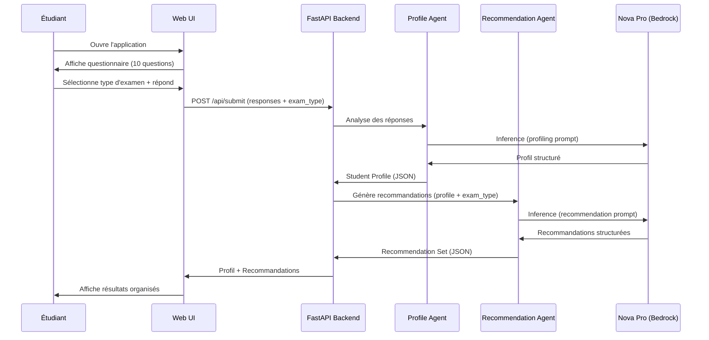

# Design Document: Orientation Mali

## Overview

Orientation Mali is a web-based school orientation application that helps Malian students (DEF and BAC exam takers) make informed decisions about their academic future. The system uses a two-agent architecture built with the Strands Agents SDK for Python, powered by Amazon Nova Pro models.

The application flow is linear:
1. Student selects exam type (DEF or BAC) and answers a 10-question profiling questionnaire
2. Profile Agent analyzes responses and generates a structured student profile
3. Recommendation Agent uses the profile to generate personalized orientation recommendations
4. Results are displayed in a clear, organized French-language interface

### Key Design Decisions

- **Agent-as-Tool pattern**: The Profile Agent is wrapped as a tool callable by an orchestrator, which then passes results to the Recommendation Agent. This keeps the pipeline explicit and testable.
- **FastAPI backend**: Lightweight Python web framework that integrates naturally with the Strands SDK (both Python).
- **Server-side rendering with Jinja2**: Simple template-based UI avoids frontend framework complexity for a form-based application.
- **Synchronous pipeline**: The questionnaire → profile → recommendations flow is sequential by nature; no need for async orchestration.

## Architecture



### Component Interaction Sequence



## Components and Interfaces

### 1. Web Layer (FastAPI + Jinja2)

**Responsibility**: Serve the questionnaire form, validate submissions, and render results.

**Routes**:

| Route | Method | Description |
|-------|--------|-------------|
| `/` | GET | Display the profiling questionnaire page |
| `/api/submit` | POST | Accept questionnaire responses, trigger agent pipeline |
| `/results` | GET | Display results (redirected after processing) |

**Templates**:
- `questionnaire.html` — Form with 10 questions + exam type selector
- `results.html` — Profile summary + organized recommendations
- `error.html` — French-language error page with retry option

### 2. Profile Agent

**Responsibility**: Analyze questionnaire responses and produce a structured student profile.

```python
from strands import Agent
from strands.models import BedrockModel

profile_model = BedrockModel(
    model_id="us.amazon.nova-pro-v1:0",
    region_name="us-east-1",
    temperature=0.3,
    max_tokens=2048,
)

profile_agent = Agent(
    model=profile_model,
    system_prompt=PROFILE_SYSTEM_PROMPT,  # French-language prompt
    tools=[],  # No external tools needed
)
```

**System Prompt** (summary): Instructs the agent to analyze student responses and output a JSON-structured profile containing strengths, interests, personality traits, and academic inclinations. All output in French.

**Input**: JSON string containing exam type and all 10 questionnaire responses.

**Output**: Structured `StudentProfile` as JSON.

### 3. Recommendation Agent

**Responsibility**: Generate personalized orientation recommendations based on the student profile and Malian education context.

```python
recommendation_model = BedrockModel(
    model_id="us.amazon.nova-pro-v1:0",
    region_name="us-east-1",
    temperature=0.5,
    max_tokens=4096,
)

recommendation_agent = Agent(
    model=recommendation_model,
    system_prompt=RECOMMENDATION_SYSTEM_PROMPT,  # French-language prompt with Mali context
    tools=[],  # No external tools needed
)
```

**System Prompt** (summary): Instructs the agent to generate recommendations specific to the Malian education system. Includes context about DEF/BAC paths, available series (Sciences Exactes, Sciences Biologiques, Lettres, Sciences Humaines, Sciences Économiques), Malian institutions, and career paths. All output in French.

**Input**: Student profile JSON + exam type.

**Output**: Structured `RecommendationSet` as JSON.

### 4. Orchestration Layer

The orchestration is handled by a service function that chains the two agents:

```python
from strands import Agent, tool

@tool
def analyze_profile(responses_json: str) -> str:
    """Analyze student questionnaire responses and generate a profile.

    Args:
        responses_json: JSON string with exam_type and questionnaire responses
    """
    response = profile_agent(responses_json)
    return str(response)

# The orchestration function
async def process_orientation(exam_type: str, responses: dict) -> OrientationResult:
    # 1. Build input for Profile Agent
    profile_input = json.dumps({"exam_type": exam_type, "responses": responses}, ensure_ascii=False)
    
    # 2. Get student profile
    profile_response = profile_agent(profile_input)
    student_profile = parse_profile(str(profile_response))
    
    # 3. Build input for Recommendation Agent
    reco_input = json.dumps({"profile": student_profile.dict(), "exam_type": exam_type}, ensure_ascii=False)
    
    # 4. Get recommendations
    reco_response = recommendation_agent(reco_input)
    recommendations = parse_recommendations(str(reco_response))
    
    return OrientationResult(profile=student_profile, recommendations=recommendations)
```

### 5. Validation Module

**Responsibility**: Validate questionnaire submissions before sending to agents.

- Verify all 10 questions are answered
- Verify exam type is either "DEF" or "BAC"
- Return French-language error messages for invalid submissions

## Data Models

### QuestionnaireSubmission

```python
from pydantic import BaseModel, Field
from typing import Literal
from enum import Enum

class ExamType(str, Enum):
    DEF = "DEF"
    BAC = "BAC"

class QuestionnaireSubmission(BaseModel):
    exam_type: ExamType
    responses: dict[str, str] = Field(
        ...,
        description="Mapping of question_id to student's answer",
        min_length=10,
        max_length=10,
    )
```

### StudentProfile

```python
class StudentProfile(BaseModel):
    strengths: list[str] = Field(..., description="Points forts identifiés")
    interests: list[str] = Field(..., description="Centres d'intérêt")
    personality_traits: list[str] = Field(..., description="Traits de personnalité")
    academic_inclinations: list[str] = Field(..., description="Inclinations académiques")
    summary: str = Field(..., description="Résumé du profil en français")
```

### RecommendationSet

```python
class RecommendedMajor(BaseModel):
    name: str = Field(..., description="Nom de la filière")
    description: str = Field(..., description="Description de la filière")
    relevance: str = Field(..., description="Pourquoi cette filière convient à l'étudiant")

class TrainingProgram(BaseModel):
    name: str = Field(..., description="Nom du programme")
    institution: str = Field(..., description="Établissement proposant le programme")
    duration: str = Field(..., description="Durée de la formation")

class School(BaseModel):
    name: str = Field(..., description="Nom de l'établissement")
    location: str = Field(..., description="Localisation au Mali")
    website: str | None = Field(None, description="Lien vers le site web")
    programs: list[str] = Field(..., description="Programmes proposés")

class CareerPath(BaseModel):
    title: str = Field(..., description="Intitulé du métier")
    description: str = Field(..., description="Description du métier")
    sector: str = Field(..., description="Secteur d'activité")

class RecommendationSet(BaseModel):
    majors: list[RecommendedMajor] = Field(..., min_length=1)
    training_programs: list[TrainingProgram] = Field(..., min_length=1)
    schools: list[School] = Field(..., min_length=1)
    career_paths: list[CareerPath] = Field(..., min_length=1)
```

### OrientationResult

```python
class OrientationResult(BaseModel):
    profile: StudentProfile
    recommendations: RecommendationSet
    exam_type: ExamType
```

### Questionnaire Definition

```python
class Question(BaseModel):
    id: str
    text: str  # French question text
    question_type: Literal["open", "multiple_choice", "scale"]
    options: list[str] | None = None  # For multiple_choice type

QUESTIONNAIRE: list[Question] = [
    # 10 questions covering interests, strengths, subjects, aspirations
]
```


## Correctness Properties

*A property is a characteristic or behavior that should hold true across all valid executions of a system — essentially, a formal statement about what the system should do. Properties serve as the bridge between human-readable specifications and machine-verifiable correctness guarantees.*

### Property 1: Incomplete submission validation identifies all missing questions

*For any* subset of questionnaire responses containing fewer than 10 answers, the validation function SHALL return error messages that reference exactly the missing question IDs, and the submission SHALL be rejected.

**Validates: Requirements 2.2**

### Property 2: Parsed StudentProfile contains all required fields

*For any* valid JSON string representing a student profile, parsing it into a StudentProfile SHALL produce an object where strengths, interests, personality_traits, and academic_inclinations are all non-empty lists, and summary is a non-empty string.

**Validates: Requirements 3.3**

### Property 3: RecommendationSet structural completeness

*For any* valid RecommendationSet, the majors, training_programs, schools, and career_paths lists SHALL each contain at least one element.

**Validates: Requirements 4.3, 4.4, 4.5, 4.6**

### Property 4: Rendered recommendations contain all category sections

*For any* valid RecommendationSet, the rendered HTML output SHALL contain distinct sections for majors, training programs, schools/universities, and career paths.

**Validates: Requirements 5.2**

### Property 5: School website links rendered when available

*For any* School with a non-null website field, the rendered HTML SHALL contain a navigable link (`<a>` tag) with that URL. For any School with a null website field, no link SHALL be rendered for that school.

**Validates: Requirements 5.3**

### Property 6: All validation error messages are in French

*For any* invalid QuestionnaireSubmission, all error messages returned by the validation module SHALL be strings from the French message catalog (i.e., shall not contain English-only error text).

**Validates: Requirements 6.3**

## Error Handling

### Agent Failure Handling

| Failure Scenario | Handling Strategy | User-Facing Message |
|-----------------|-------------------|---------------------|
| Profile Agent timeout | Retry once, then show error | "Une erreur est survenue lors de l'analyse de votre profil. Veuillez réessayer." |
| Profile Agent invalid output | Attempt re-parse, then show error | "Nous n'avons pas pu analyser vos réponses. Veuillez réessayer." |
| Recommendation Agent timeout | Retry once, then show error | "Une erreur est survenue lors de la génération des recommandations. Veuillez réessayer." |
| Recommendation Agent invalid output | Attempt re-parse, then show error | "Nous n'avons pas pu générer vos recommandations. Veuillez réessayer." |
| Bedrock service unavailable | Show maintenance message | "Le service est temporairement indisponible. Veuillez réessayer dans quelques minutes." |

### Validation Error Handling

- Missing responses: Return a list of unanswered question numbers in French
- Invalid exam type: "Veuillez sélectionner votre type d'examen (DEF ou BAC)."
- Empty responses: "Veuillez répondre à toutes les questions avant de soumettre."

### Error Response Structure

```python
class ErrorResponse(BaseModel):
    error: bool = True
    message: str  # French error message
    retry_available: bool = True
    missing_questions: list[str] | None = None  # For validation errors
```

### Retry Strategy

- Agent failures: Automatic single retry with exponential backoff (2s delay)
- After retry failure: Display error page with manual retry button
- Validation errors: No retry needed — show inline errors and let user correct

## Testing Strategy

### Unit Tests

Unit tests cover specific examples and edge cases:

- **Validation module**: Test with 0, 5, 9, and 10 responses; invalid exam types; empty strings
- **Profile parsing**: Test with valid JSON, malformed JSON, missing fields, extra fields
- **Recommendation parsing**: Test with valid JSON, empty lists, missing sections
- **Rendering**: Test template output with known data, verify HTML structure
- **Error handling**: Test each failure scenario produces correct French error message

### Property-Based Tests

Property-based tests verify universal properties across generated inputs. Using **Hypothesis** (Python PBT library).

**Configuration**:
- Minimum 100 iterations per property test
- Each test tagged with: `Feature: orientation-mali, Property {number}: {property_text}`

**Properties to implement**:
1. Validation identifies missing questions (generate random subsets of 0-9 responses)
2. StudentProfile parsing completeness (generate valid profile JSON structures)
3. RecommendationSet structural invariant (generate recommendation structures)
4. Rendered output section completeness (generate valid RecommendationSets, render, check sections)
5. School link rendering (generate Schools with/without websites, verify link presence)
6. French validation messages (generate invalid submissions, verify message language)

### Integration Tests

Integration tests verify the full pipeline with actual agent calls:

- Profile Agent produces parseable output for DEF student
- Profile Agent produces parseable output for BAC student
- Recommendation Agent produces valid recommendations for DEF profile
- Recommendation Agent produces valid recommendations for BAC profile
- Full pipeline (questionnaire → profile → recommendations) completes successfully
- Agent output is in French (language detection)
- Recommendations reference Malian institutions

### Test Organization

```
tests/
├── unit/
│   ├── test_validation.py
│   ├── test_profile_parsing.py
│   ├── test_recommendation_parsing.py
│   └── test_rendering.py
├── property/
│   ├── test_validation_properties.py
│   ├── test_parsing_properties.py
│   └── test_rendering_properties.py
└── integration/
    ├── test_profile_agent.py
    ├── test_recommendation_agent.py
    └── test_pipeline.py
```
